# Diagramas UML e Padrões de Projeto — ENEM IA

> Documentação arquitetural completa. Os diagramas usam sintaxe Mermaid,
> renderizados automaticamente pelo GitHub. Para visualizar localmente,
> use a extensão "Markdown Preview Mermaid Support" no VS Code.

---

## Índice

1. [Diagrama de Casos de Uso](#1-diagrama-de-casos-de-uso)
2. [Diagrama de Classes (Domínio)](#2-diagrama-de-classes-domínio)
3. [Diagrama de Classes (Backend — Repositórios)](#3-diagrama-de-classes-backend--repositórios)
4. [Diagrama de Sequência — Fluxo de Correção](#4-diagrama-de-sequência--fluxo-de-correção)
5. [Diagrama de Sequência — Autenticação](#5-diagrama-de-sequência--autenticação)
6. [Diagrama de Estados — Ciclo da Redação](#6-diagrama-de-estados--ciclo-da-redação)
7. [Diagrama de Componentes](#7-diagrama-de-componentes)
8. [Diagrama de Implantação (Deploy)](#8-diagrama-de-implantação-deploy)
9. [Diagrama ER — Banco de Dados](#9-diagrama-er--banco-de-dados)
10. [Diagrama de Atividades — Pipeline de Correção](#10-diagrama-de-atividades--pipeline-de-correção)
11. [Padrões de Projeto](#11-padrões-de-projeto)

---

## 1. Diagrama de Casos de Uso

O diagrama de casos de uso descreve **o que o sistema faz** do ponto de vista dos usuários (atores), sem entrar em detalhes de implementação. Cada elipse é um caso de uso — uma funcionalidade com valor para o ator.

```mermaid
flowchart TB
    Professor(["👨‍🏫\nProfessor"])
    Aluno(["🎓\nAluno"])
    IA(["🤖\nIA - OpenAI"])

    subgraph Sistema["🏛️  ENEM IA — Sistema"]
        direction TB

        subgraph GestaoConteudo["📚 Gestão de Conteúdo"]
            UC1["Cadastrar aluno"]
            UC2["Cadastrar turma"]
            UC3["Cadastrar tema"]
            UC4["Compartilhar QR Code da turma"]
        end

        subgraph Correcao["✏️ Fluxo de Correção"]
            UC5["Enviar redação por foto"]
            UC6["Enviar redação por texto"]
            UC7["Acompanhar progresso da correção"]
            UC8["Ver resultado completo (C1–C5)"]
            UC9["Adicionar avaliação manual"]
        end

        subgraph Analise["📊 Análise e Acompanhamento"]
            UC10["Ver dashboard pedagógico"]
            UC11["Ver ranking de alunos"]
            UC12["Ver analytics da turma"]
            UC13["Receber notificação de correção"]
        end

        subgraph AreaAluno["🎓 Área do Aluno"]
            UC14["Acessar via QR Code"]
            UC15["Acessar via código pessoal"]
            UC16["Ver próprias redações e notas"]
            UC17["Ver evolução histórica"]
            UC18["Ver ranking da turma"]
            UC19["Enviar redação (aluno)"]
        end

        subgraph Conta["🔐 Gestão de Conta"]
            UC20["Criar conta de professor"]
            UC21["Fazer login / logout"]
            UC22["Recuperar senha por e-mail"]
        end

        UC5 -.->|"inclui"| UC7
        UC6 -.->|"inclui"| UC7
        UC7 -.->|"inclui"| UC8
        UC5 -.->|"usa"| IA
        UC6 -.->|"usa"| IA
    end

    Professor --> UC1 & UC2 & UC3 & UC4
    Professor --> UC5 & UC6 & UC8 & UC9
    Professor --> UC10 & UC11 & UC12 & UC13
    Professor --> UC20 & UC21 & UC22

    Aluno --> UC14 & UC15
    Aluno --> UC16 & UC17 & UC18 & UC19
```

### Explicação dos atores

| Ator | Descrição |
|---|---|
| **Professor** | Usuário principal. Cadastra alunos, envia redações, recebe correções, analisa turma. Tem conta própria (e-mail + senha). |
| **Aluno** | Usuário secundário. Acessa com código gerado pelo professor. Não cria conta. Vê apenas seus próprios dados. |
| **IA (OpenAI)** | Ator externo. Recebe a imagem da redação e retorna avaliação estruturada em JSON. |

### Relacionamentos

- **`inclui` (<<include>>)**: o caso de uso base sempre executa o incluído (enviar redação *inclui* acompanhar progresso)
- **`usa`**: o sistema delega para a IA a avaliação das competências

---

## 2. Diagrama de Classes (Domínio)

O diagrama de classes representa as **entidades do negócio** e seus relacionamentos. É a espinha dorsal do modelo de dados compartilhado entre frontend e backend.

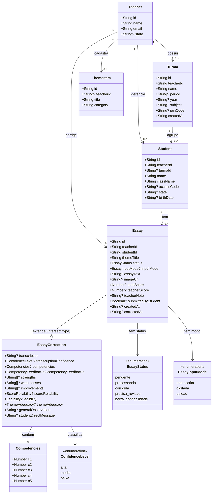

### Por que esse modelo?

O tipo `Essay` é uma **interseção** de `EssayBase` com `EssayCorrection` (TypeScript intersection type). Isso separa claramente:
- **`EssayBase`**: dados que existem antes da correção (studentId, imageUri, status)
- **`EssayCorrection`**: dados que só existem após a correção (competencies, feedbacks, transcription)

Permite que a tela de lista de redações use apenas `EssayBase` sem carregar dados pesados de correção.

---

## 3. Diagrama de Classes (Backend — Repositórios)

Este diagrama mostra a arquitetura da **camada de repositório** do backend, implementando o padrão Repository sobre um driver de banco de dados dual (SQLite/PostgreSQL).

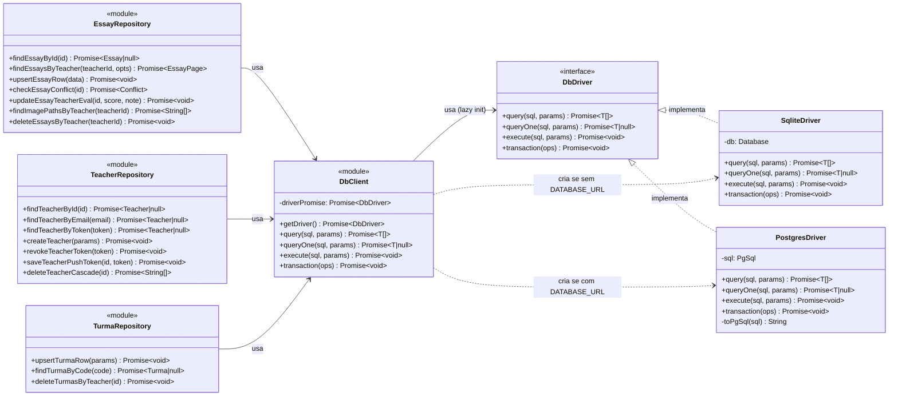

---

## 4. Diagrama de Sequência — Fluxo de Correção

O diagrama de sequência mostra a **interação entre objetos ao longo do tempo**. Este é o fluxo mais crítico do sistema: do toque do professor em "Enviar" até a notificação de conclusão.

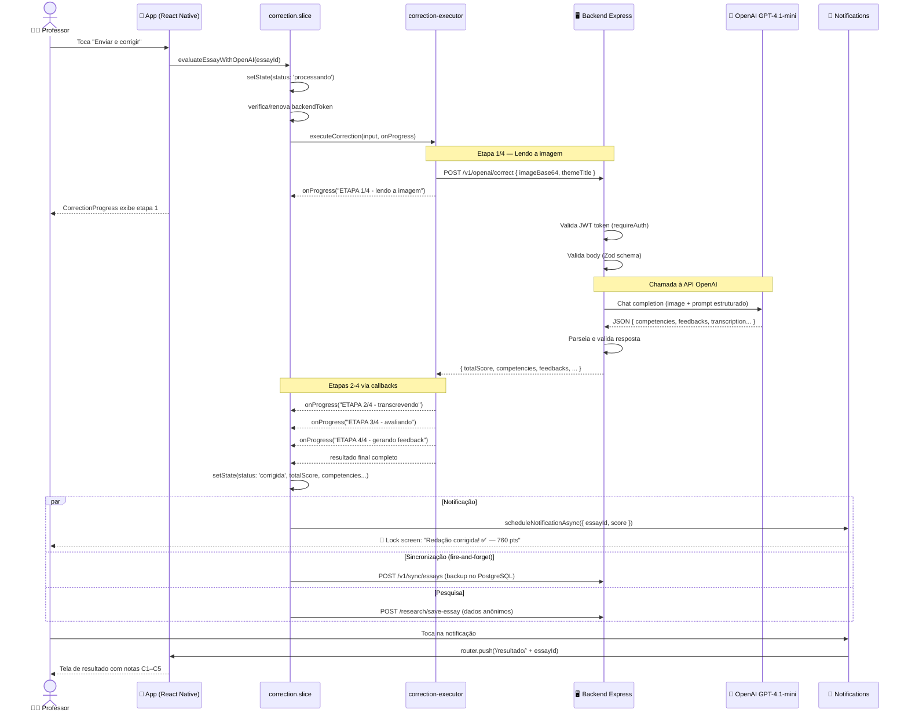

### Pontos de atenção no fluxo

- **Par (paralelo)**: após a correção, três ações acontecem simultaneamente (notificação, sync, pesquisa). Nenhuma bloqueia a UI.
- **Fire-and-forget**: sync e pesquisa usam `.catch(() => {})` — falhas não afetam o usuário.
- **onProgress callbacks**: permitem atualizar a barra de progresso em tempo real sem esperar a resposta final.

---

## 5. Diagrama de Sequência — Autenticação

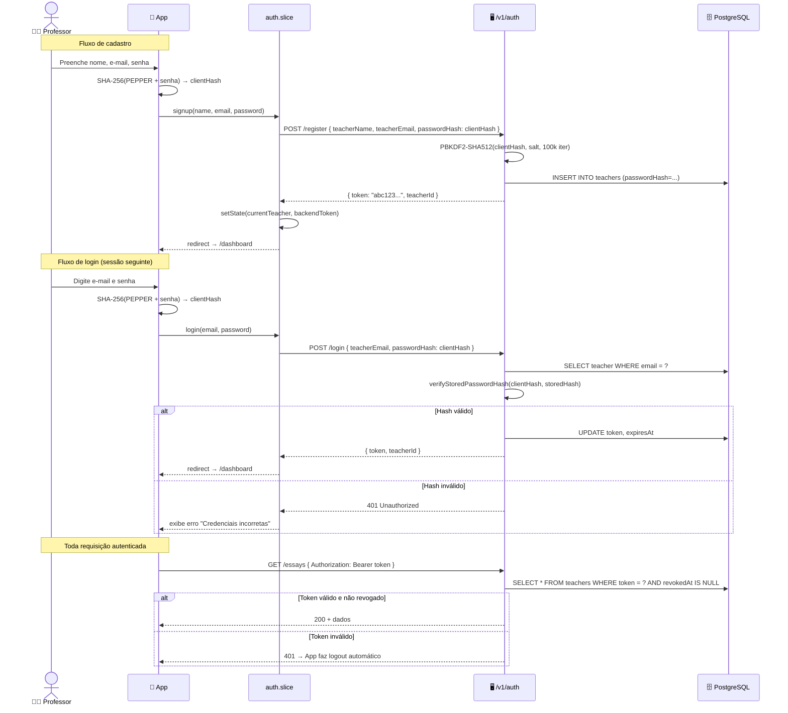

---

## 6. Diagrama de Estados — Ciclo da Redação

O diagrama de estados modela os **possíveis estados de uma redação** e as transições entre eles. É essencial para entender a lógica de retry e a fila offline.

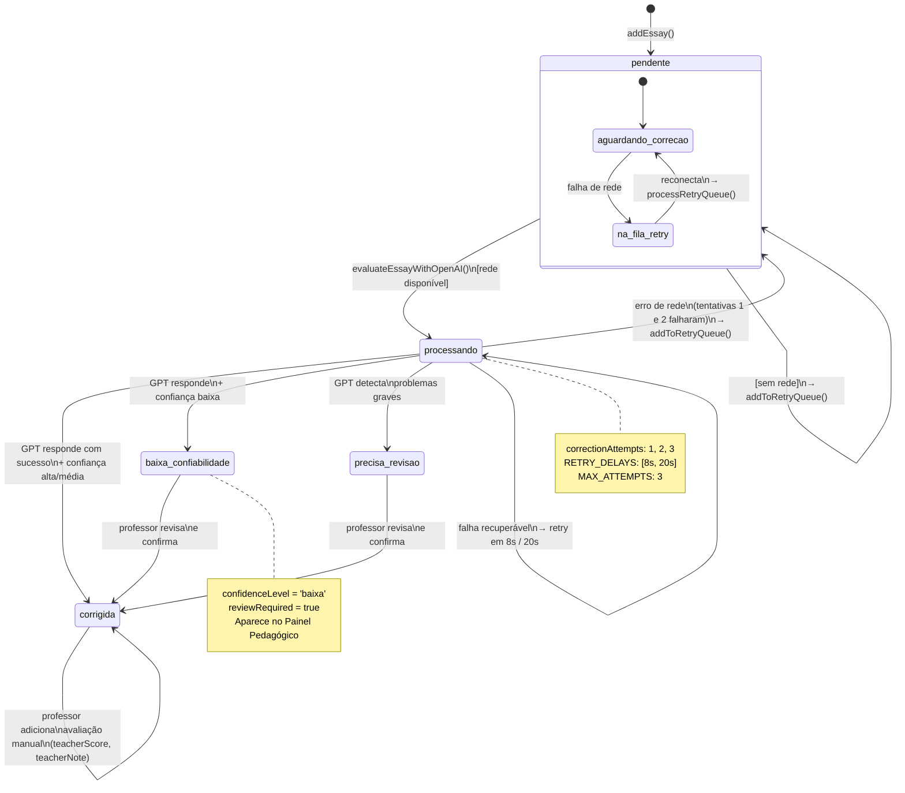

### Estados e seu significado

| Estado | Descrição | Ação do usuário |
|---|---|---|
| `pendente` | Criada, aguardando correção | Professor pode iniciar correção manualmente |
| `processando` | IA está avaliando | Aguardar (progresso mostrado na tela) |
| `corrigida` | Correção concluída com sucesso | Ver resultado |
| `baixa_confiabilidade` | IA teve dificuldade (foto ruim, letra ilegível) | Professor revisa e confirma |
| `precisa_revisao` | IA detectou problema grave no texto | Professor revisa e confirma |

---

## 7. Diagrama de Componentes

Mostra os **módulos do sistema e suas dependências**. Cada componente é uma unidade deployável ou um subsistema lógico coeso.

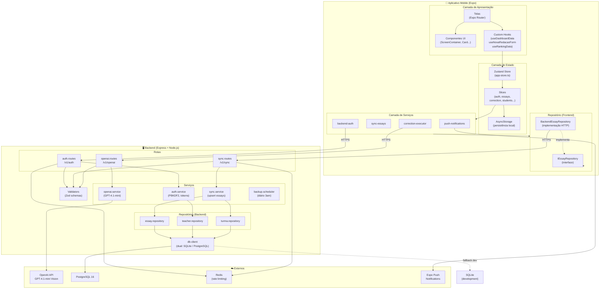

---

## 8. Diagrama de Implantação (Deploy)

Mostra como os **componentes de software são distribuídos em hardware/infraestrutura**.

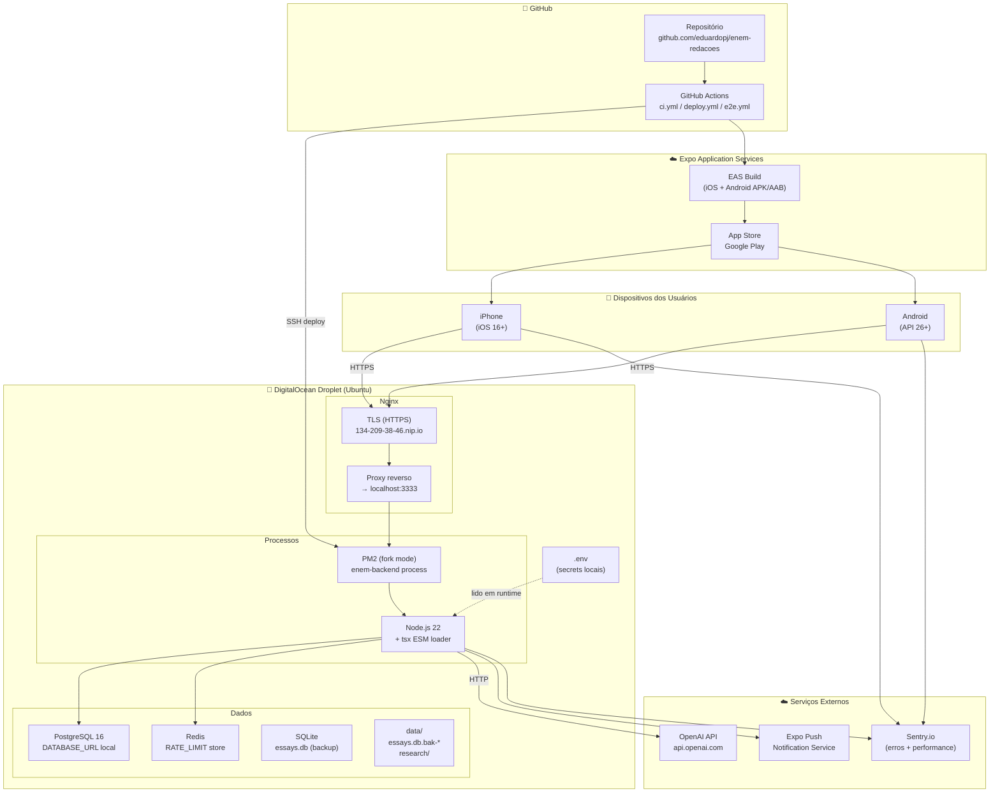

### Fluxo de deploy

```
1. git push origin main
2. GitHub Actions: ci.yml (testes backend + frontend)
3. Se testes passam: deploy.yml
   a. SSH no droplet
   b. cp -r backend/ backend.previous  ← snapshot
   c. git pull / npm ci
   d. pm2 restart enem-backend
   e. curl /health → verifica DB + servidor
   f. Se health falha: restaura backend.previous
```

---

## 9. Diagrama ER — Banco de Dados

O diagrama entidade-relacionamento mostra a **estrutura do banco de dados PostgreSQL** em produção e as chaves de relacionamento entre tabelas.

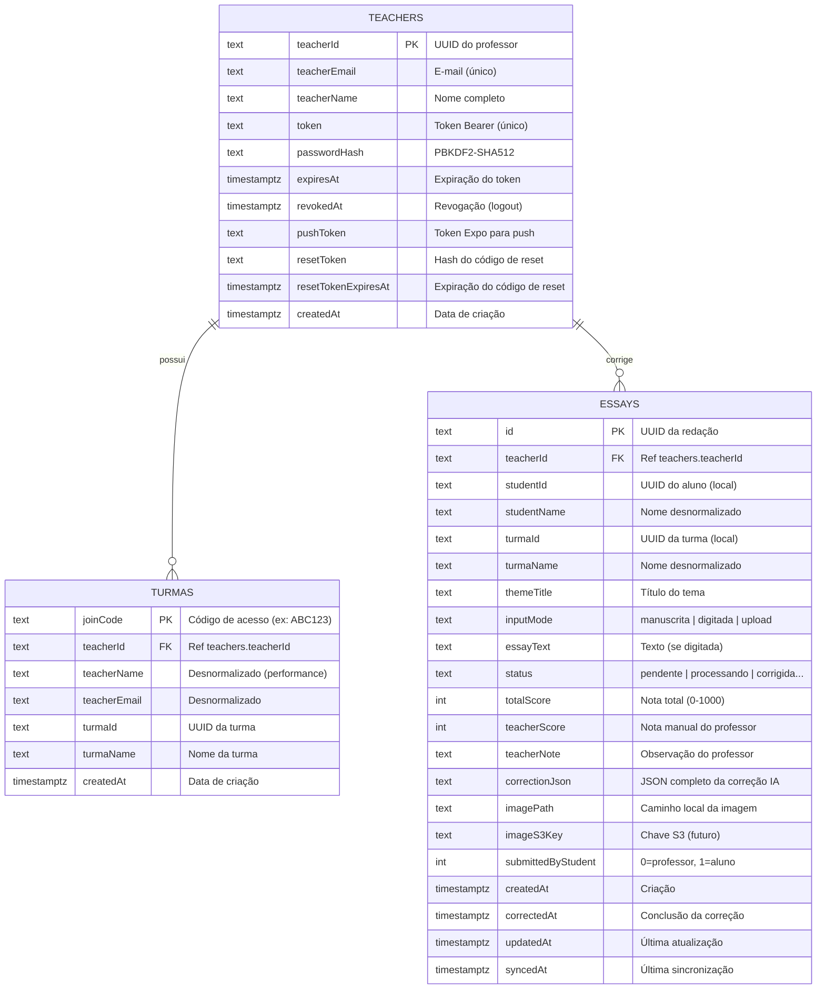

### Decisões de design do banco

**Desnormalização deliberada**: `studentName`, `turmaName`, `teacherName` são copiados para `essays` e `turmas`. Evita JOINs custosos em consultas frequentes de listagem. Os dados de alunos vivem no AsyncStorage do dispositivo, não no servidor.

**`correctionJson` como TEXT**: o resultado completo da IA é armazenado como JSON serializado. Isso evita dezenas de colunas para campos opcionais e permite evolução do schema da IA sem migrations de banco.

**`syncedAt` para paginação**: o cursor de paginação usa `syncedAt DESC` — o índice `idx_essays_teacher_synced` cobre exatamente essa query, tornando-a O(log n) mesmo com milhões de redações.

---

## 10. Diagrama de Atividades — Pipeline de Correção

O diagrama de atividades mostra o **fluxo algorítmico** com decisões, paralelismo e condições de erro. É mais detalhado que o de sequência — foca no COMO, não no QUEM.

```mermaid
flowchart TD
    Start([Início: evaluateEssayWithOpenAI]) --> CheckEssay{Essay existe\nno store?}
    CheckEssay -->|Não| Throw([Lança erro: não encontrada])
    CheckEssay -->|Sim| CheckImage{Tem imagem\nou texto?}
    CheckImage -->|Não| Throw2([Lança erro: sem arquivo])
    CheckImage -->|Sim| SetProcessing[status → 'processando'\nattempts++]

    SetProcessing --> CheckToken{Tem\nbackendToken?}
    CheckToken -->|Não| AutoRegister[Auto-register\nno backend]
    AutoRegister --> SaveToken[salva token no store]
    SaveToken --> CallExecutor
    CheckToken -->|Sim| CallExecutor[correction-executor\nexecuteCorrection]

    CallExecutor --> Progress1[onProgress: ETAPA 1/4\nlendo a imagem]
    Progress1 --> BackendCall[POST /v1/openai/correct\n{ imageBase64 ou texto }]

    BackendCall --> BackendValidate{Zod\nvalida input?}
    BackendValidate -->|Inválido| Return400[400 Bad Request]
    BackendValidate -->|Válido| CheckAuth{Token\nválido?}
    CheckAuth -->|Inválido| Return401[401 Unauthorized]
    CheckAuth -->|Válido| GPTCall[OpenAI GPT-4.1-mini\nVision API]

    GPTCall --> Progress2[onProgress: ETAPA 2/4\ntranscrevendo]
    Progress2 --> Progress3[onProgress: ETAPA 3/4\navaliando]
    Progress3 --> Progress4[onProgress: ETAPA 4/4\ngerando feedback]
    Progress4 --> ParseResult[Parseia JSON da resposta]

    ParseResult --> UpdateStore[store: status → 'corrigida'\ntotalScore, competencies, feedbacks...]

    UpdateStore --> par1{Paralelismo}
    par1 --> Notif[scheduleNotificationAsync\nlock screen notification]
    par1 --> SyncBackend[backendEssayRepository.push\nsinc com PostgreSQL]
    par1 --> Research[saveEssayForResearch\ndados anônimos]

    Notif & SyncBackend & Research --> End([Fim: correção concluída])

    BackendCall -->|Erro| ErrorHandler{Tipo\ndo erro}
    ErrorHandler -->|Rate limit 429| SetError[status → 'pendente'\nerrorMessage: aguarde]
    ErrorHandler -->|Rede| CheckAttempts{attempts\n< MAX = 3?}
    ErrorHandler -->|Outro| SetError2[status → 'pendente'\nerrorMessage: mensagem]

    CheckAttempts -->|Sim| RetryDelay[setTimeout\n8s ou 20s]
    RetryDelay --> CallExecutor
    CheckAttempts -->|Não| AddRetryQueue[addToRetryQueue\n→ fila offline]
    AddRetryQueue --> SetError2

    style Start fill:#7C3AED,color:#fff
    style End fill:#16A34A,color:#fff
    style Throw fill:#DC2626,color:#fff
    style Throw2 fill:#DC2626,color:#fff
    style Return400 fill:#DC2626,color:#fff
    style Return401 fill:#DC2626,color:#fff
```

---

## 11. Padrões de Projeto

Os padrões de projeto são **soluções reutilizáveis para problemas recorrentes** de design de software. Abaixo estão os padrões utilizados no ENEM IA, com localização exata no código, motivação e benefícios.

---

### 11.1 Repository Pattern

**Categoria**: Arquitetural (Data Access)

**O que é**: Define uma interface que abstrai o acesso a dados. O código de negócio depende da interface, não da implementação concreta. Isso permite trocar o banco de dados sem alterar os serviços.

**Onde está no código**:
```
Backend:
  src/repositories/essay.repository.ts    ← implementação
  src/repositories/teacher.repository.ts
  src/repositories/turma.repository.ts

Frontend:
  src/repositories/IEssayRepository.ts    ← interface
  src/repositories/BackendEssayRepository.ts ← implementação HTTP
```

**Diagrama**:
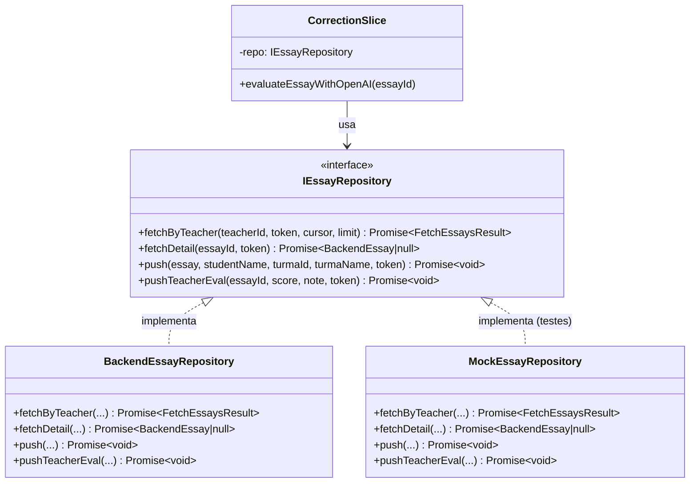

**Por que usar**:
- **Testabilidade**: nos testes, troca `BackendEssayRepository` por `MockEssayRepository` sem alterar o slice
- **Flexibilidade**: se migrar para tRPC puro, só cria `TRPCEssayRepository`
- **Inversão de dependência**: o slice depende de abstração, não de implementação concreta (SOLID - D)

---

### 11.2 Adapter Pattern (toPgSql)

**Categoria**: Estrutural

**O que é**: Converte a interface de uma classe para outra interface esperada pelo cliente. Permite que classes com interfaces incompatíveis trabalhem juntas.

**Onde está no código**:
```
backend/src/services/db-client.ts → função toPgSql()
```

**Problema**: os repositórios escrevem SQL em dialeto SQLite (`?` placeholders, `datetime('now')`, identificadores camelCase sem aspas). O PostgreSQL usa `$1/$2`, `CURRENT_TIMESTAMP` e exige aspas em identificadores case-sensitive.

**Solução**:
```typescript
// Adapter: converte SQLite SQL → PostgreSQL SQL
function toPgSql(sql: string): string {
  // 1. datetime('now') → CURRENT_TIMESTAMP
  sql = sql.replace(/datetime\s*\(\s*'now'\s*\)/gi, 'CURRENT_TIMESTAMP');
  // 2. ? → $1, $2, ...
  let n = 0;
  sql = sql.replace(/\?/g, () => `$${++n}`);
  // 3. camelCase → "camelCase"
  sql = sql.replace(/\b([a-z][a-zA-Z0-9]*[A-Z][a-zA-Z0-9]*)\b/g, '"$1"');
  return sql;
}
```

**Por que usar**:
- **Zero mudança nos repositórios**: os 3 repositórios continuam escrevendo SQL natural
- **Transparente**: o adapter age no nível do driver, invisível para quem usa `query()`, `execute()`, etc.
- **Manutenção centralizada**: qualquer evolução do dialeto SQL fica em um lugar só

---

### 11.3 Strategy Pattern (Dual-Mode DB)

**Categoria**: Comportamental

**O que é**: Define uma família de algoritmos, encapsula cada um e os torna intercambiáveis. O cliente usa o algoritmo sem conhecer sua implementação.

**Onde está no código**:
```
backend/src/services/db-client.ts
  → makeSqliteDriver() ← estratégia desenvolvimento
  → makePgDriver()     ← estratégia produção
```

**Diagrama**:
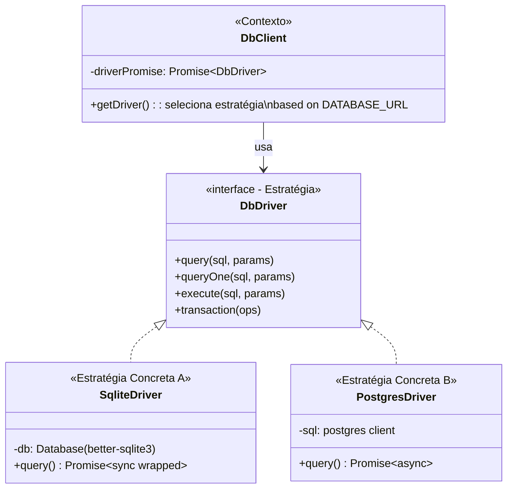

**Seleção da estratégia**:
```typescript
// A estratégia é selecionada em runtime por variável de ambiente
driverPromise = env.databaseUrl
  ? makePgDriver(env.databaseUrl)   // produção
  : makeSqliteDriver();              // desenvolvimento
```

**Por que usar**:
- **DX (Developer Experience)**: desenvolvedor roda com SQLite sem instalar PostgreSQL
- **CI/CD**: testes rodam com SQLite (rápido, sem infraestrutura)
- **Produção**: PostgreSQL em produção sem alterar uma linha nos repositórios
- **Rollback seguro**: se remover `DATABASE_URL` do `.env`, volta para SQLite imediatamente

---

### 11.4 Factory Pattern

**Categoria**: Criacional

**O que é**: Define uma interface para criar objetos, mas deixa as subclasses decidirem qual classe instanciar. Encapsula a lógica de criação de objetos complexos.

**Onde está no código**:
```
backend/src/services/db-client.ts
  → makePgDriver(url)     ← Factory A: cria driver PostgreSQL
  → makeSqliteDriver()    ← Factory B: cria driver SQLite

backend/src/config/env.ts
  → env object            ← Factory de configuração tipada
```

**Código**:
```typescript
// Factory: cria e configura o driver PostgreSQL completo
async function makePgDriver(databaseUrl: string): Promise<DbDriver> {
  const postgres = await import('postgres');  // lazy import
  const sql = postgres(databaseUrl, {
    max: 10,
    idle_timeout: 30,
    connect_timeout: 10,
    onnotice: () => {},  // suprime NOTICEs de índices existentes
  });

  await sql.unsafe(PG_SCHEMA);  // auto-cria tabelas (idempotente)

  return {
    query: async (sql, params) => ...,
    queryOne: async (sql, params) => ...,
    execute: async (sql, params) => ...,
    transaction: async (ops) => ...,
  };
}
```

**Por que usar**:
- **Encapsulamento**: quem usa `getDriver()` não sabe como o driver foi criado
- **Lazy initialization**: o driver só é criado na primeira query (economiza recursos)
- **Auto-schema**: a factory PostgreSQL inicializa o banco automaticamente — zero step manual de setup

---

### 11.5 Observer Pattern (Zustand)

**Categoria**: Comportamental

**O que é**: Define uma dependência um-para-muitos entre objetos. Quando um objeto muda de estado, todos os seus dependentes são notificados automaticamente.

**Onde está no código**:
```
src/store/app-store.ts  ← Subject (observable)
Componentes React       ← Observers
useAppStore(selector)   ← subscrição seletiva
```

**Como funciona no Zustand**:
```typescript
// Subject: o store notifica observers quando muda
const useAppStore = create(
  persist(
    (...args) => ({
      ...createAuthSlice(...args),
      ...createEssaysSlice(...args),
      ...createCorrectionSlice(...args),
    }),
    { name: 'app-store', storage: AsyncStorage }
  )
);

// Observer A: componente React
function DashboardScreen() {
  // Subscreve APENAS essays (não re-renderiza quando teacher muda)
  const essays = useAppStore(state => state.essays);
  return <Text>{essays.length}</Text>;
}

// Observer B: outro componente
function KpiCard() {
  const count = useAppStore(state => state.students.length);
}
```

**useShallow — otimização de observadores**:
```typescript
// Sem useShallow: re-renderiza toda vez que o store muda
const { essays, students } = useAppStore(state => ({
  essays: state.essays,
  students: state.students,
}));

// Com useShallow: só re-renderiza se essays ou students mudaram (shallow equal)
const { essays, students } = useAppStore(
  useShallow(state => ({ essays: state.essays, students: state.students }))
);
```

**Por que usar**:
- **Reatividade**: UI atualiza automaticamente quando o estado muda, sem `setState` manual
- **Performance**: `useShallow` e seletores granulares evitam re-renders desnecessários
- **Persistência**: o pattern se integra com `AsyncStorage` transparentemente

---

### 11.6 Command Queue Pattern (Fila de Correção)

**Categoria**: Comportamental

**O que é**: Encapsula requisições como objetos em uma fila. Permite enfileirar, desfazer e reexecutar operações de forma controlada, com concorrência limitada.

**Onde está no código**:
```
src/services/correction/correction-executor.ts
  → p-queue (biblioteca de fila de promises)
src/store/slices/correction.slice.ts
  → retryQueue: string[]  ← IDs na fila de retry offline
```

**Diagrama**:
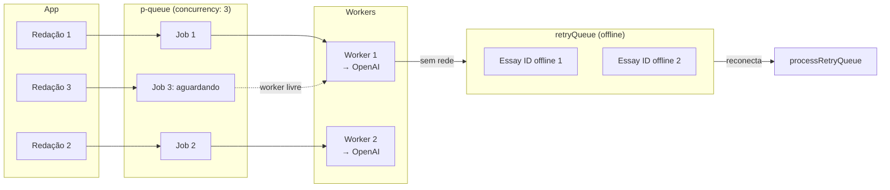

**Por que usar**:
- **Controle de concorrência**: evita sobrecarregar a API da OpenAI com muitas requisições simultâneas
- **Retry resiliente**: redações que falham por rede ficam em `retryQueue` e são reprocessadas ao reconectar
- **UX fluida**: o professor pode continuar usando o app enquanto as correções processam em background

---

### 11.7 Facade Pattern (API Service)

**Categoria**: Estrutural

**O que é**: Fornece uma interface simplificada para um subsistema complexo. Esconde a complexidade interna atrás de uma API de alto nível.

**Onde está no código**:
```
src/services/api.ts  ← Facade sobre fetch() do browser
```

**Problema**: cada chamada HTTP precisaria de: URL base, headers de auth, tratamento de 401, serialização de body, parsing de resposta.

**Facade**:
```typescript
// Facade: esconde toda a complexidade do HTTP
async function apiRequest<T>(
  endpoint: string,
  options: RequestInit = {}
): Promise<T> {
  const url = `${getBackendUrl()}${endpoint}`;
  const token = getStoredToken();

  const res = await fetch(url, {
    ...options,
    headers: {
      'Content-Type': 'application/json',
      ...(token ? { Authorization: `Bearer ${token}` } : {}),
      ...options.headers,
    },
  });

  if (res.status === 401) {
    // Trigger logout automático via handler global
    unauthorizedHandler?.();
    throw new Error('Unauthorized');
  }

  if (!res.ok) throw new Error(`HTTP ${res.status}`);
  return res.json();
}

// Uso simples (consumidor não conhece a complexidade):
const essays = await apiRequest<BackendEssay[]>('/v1/sync/essays');
```

**Por que usar**:
- **DRY**: lógica de auth, URL base e error handling em um lugar
- **Manutenção**: para mudar o endpoint base ou adicionar um header global, muda um arquivo
- **Testabilidade**: fácil de mockar nas suites de teste

---

### 11.8 Singleton Pattern (Database + Store)

**Categoria**: Criacional

**O que é**: Garante que uma classe tenha apenas uma instância e fornece um ponto global de acesso a ela.

**Onde está no código**:
```
backend/src/services/database.ts  ← Singleton SQLite
src/store/app-store.ts            ← Singleton Zustand store
```

**Database singleton**:
```typescript
// database.ts — criado uma vez, importado em todos os repositórios JS
const db = new Database(join(DATA_DIR, 'essays.db'));
db.pragma('journal_mode = WAL');
db.pragma('foreign_keys = ON');

// Todas as migrations idempotentes
try { db.exec(`ALTER TABLE teachers ADD COLUMN expiresAt TEXT`); } catch (_) {}

export default db;  // mesmo objeto em toda a aplicação
```

**Por que usar**:
- **Conexão única**: banco de dados não suporta múltiplas conexões de escrita simultâneas (SQLite especialmente)
- **WAL mode**: Journal mode WAL ativado uma vez na inicialização → melhora performance de leitura
- **Estado global**: o store Zustand é singleton por design — todos os componentes acessam o mesmo estado

---

### 11.9 Slice Pattern (Zustand)

**Categoria**: Arquitetural (State Management)

**O que é**: Divide o estado global em fatias (slices) independentes, cada uma responsável por um domínio. Os slices são combinados em um único store.

**Onde está no código**:
```
src/store/slices/
  auth.slice.ts       ← professor, token, consentimento Sentry
  essays.slice.ts     ← CRUD de redações
  correction.slice.ts ← pipeline de correção + retry queue
  students.slice.ts   ← alunos
  themes.slice.ts     ← temas
  turmas.slice.ts     ← turmas
  sync.slice.ts       ← sincronização com backend
```

**Composição**:
```typescript
// app-store.ts — combina todos os slices
const useAppStore = create<AppState>()(
  persist(
    (...args) => ({
      ...createAuthSlice(...args),
      ...createEssaysSlice(...args),
      ...createCorrectionSlice(...args),
      ...createStudentsSlice(...args),
      ...createThemesSlice(...args),
      ...createTurmasSlice(...args),
      ...createSyncSlice(...args),
    }),
    { name: 'enem-ia-store', storage: createJSONStorage(() => AsyncStorage) }
  )
);
```

**Por que usar**:
- **SRP (Single Responsibility)**: cada slice tem uma responsabilidade única
- **Escalabilidade**: adicionar um novo domínio = criar um novo slice sem tocar nos existentes
- **Testabilidade**: cada slice pode ser testado isoladamente (como visto em `essays.slice.test.ts`)
- **Colocação**: estado e lógica relacionados ficam juntos (vs. espalhados em Context API)

---

### 11.10 Retry + Exponential Backoff

**Categoria**: Resiliência

**O que é**: Quando uma operação falha, tenta novamente após um delay crescente. Evita sobrecarregar sistemas instáveis com retries imediatos.

**Onde está no código**:
```
src/store/slices/correction.slice.ts
  → RETRY_DELAYS = [8_000, 20_000]
  → MAX_ATTEMPTS = 3
```

**Implementação**:
```typescript
const RETRY_DELAYS = [8_000, 20_000];  // 8s, 20s
const MAX_ATTEMPTS = 3;

// Attempt 1: falha → aguarda 8s → Attempt 2
// Attempt 2: falha → aguarda 20s → Attempt 3
// Attempt 3: falha → status 'pendente' + addToRetryQueue()

const canRetry = !isRateLimited && isRetriableError(error) && currentAttempts < MAX_ATTEMPTS;
const retryDelay = RETRY_DELAYS[currentAttempts - 1] ?? RETRY_DELAYS[RETRY_DELAYS.length - 1];

if (canRetry) {
  setTimeout(() => {
    get().evaluateEssayWithOpenAI(essayId).catch(() => {});
  }, retryDelay);
} else {
  if (isNetworkError(message)) get().addToRetryQueue(essayId);
}
```

**Por que usar**:
- **Resiliência**: instabilidades temporárias da API da OpenAI não resultam em erro permanente
- **Rate limiting**: delays crescentes respeitam os limites da API
- **UX**: o professor vê "Tentativa 2/3, tentando em 20s..." em vez de erro imediato
- **Offline-first**: redações que falham por rede são retomadas automaticamente na reconexão

---

## Resumo dos Padrões

| Padrão | Categoria | Onde | Benefício principal |
|---|---|---|---|
| Repository | Arquitetural | `*Repository.ts` | Abstração do banco de dados |
| Adapter | Estrutural | `toPgSql()` | SQLite SQL funciona no PostgreSQL |
| Strategy | Comportamental | `db-client.ts` | SQLite dev, PostgreSQL prod |
| Factory | Criacional | `makePgDriver()` | Criação encapsulada de drivers |
| Observer | Comportamental | Zustand store | UI reativa ao estado |
| Command Queue | Comportamental | `p-queue`, `retryQueue` | Controle de concorrência |
| Facade | Estrutural | `apiRequest()` | HTTP simplificado |
| Singleton | Criacional | `database.ts`, store | Instância única compartilhada |
| Slice | Arquitetural | Zustand slices | Estado modular e testável |
| Retry + Backoff | Resiliência | `correction.slice.ts` | Tolerância a falhas temporárias |
